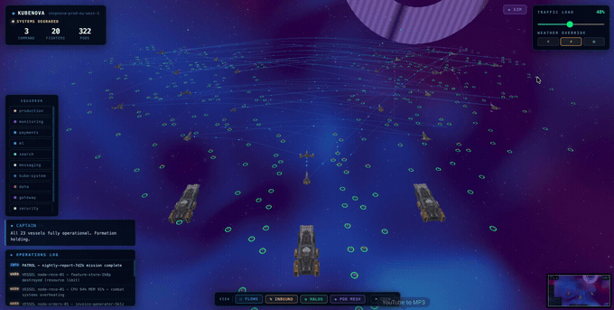
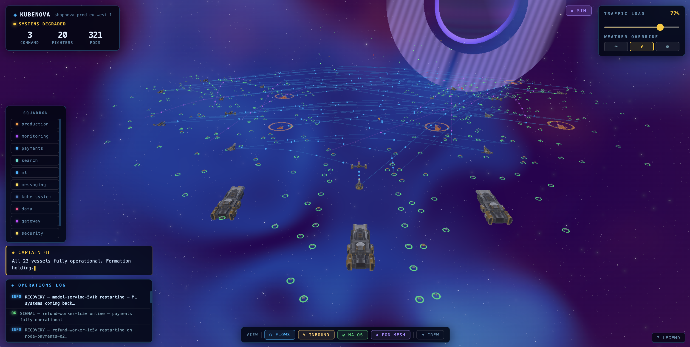
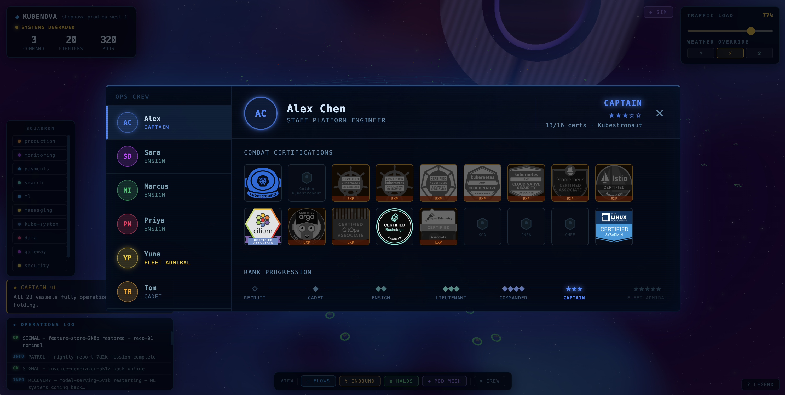
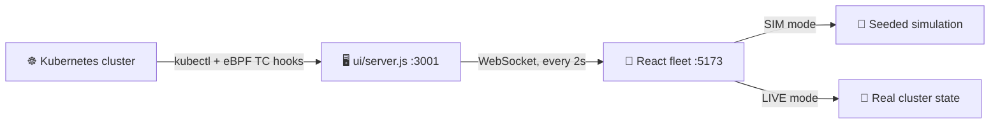

<div align="center">

<strong>🛰️ AMBIENT KUBERNETES VISUALIZATION</strong>

# 🚀 KubeNova

### Your cluster, reimagined as a 3D space fleet.

Nodes become capital ships. Pods become fighter craft flying in squadron formation. A nebula
storm swells when cluster health degrades, and pods explode in the void when they crash.

**[🛸 Start training your fleet](#-quick-start)** · [See the loop](#-how-it-flows) · [What's inside](#-whats-in-the-box) · [Read the security model](#-security-model)

[](LICENSE)

[](https://github.com/david6983/kubenova/actions/workflows/docker.yml)


</div>

<p align="center">
  
</p>

No dashboards, no graphs to parse — just a living scene you can read at a glance from across
the room. Toggle **SIM** for a fully offline demo, or **LIVE** to fly your real cluster, backed
by an eBPF agent that reads real pod CPU/mem and network flows.

> [!IMPORTANT]
> This is an early preview. The 3D visualization and the eBPF metrics agent both work today.
> A lot of the roadmap below is still being built.

## ✨ Why a space fleet

<table>
  <tr>
    <td width="33%" valign="top">
      <h3>🛰️ Ambient by design</h3>
      No alerts to triage or panels to click through. Put it on a screen in the office, let it
      run, and glance at it instead of a dashboard.
    </td>
    <td width="33%" valign="top">
      <h3>📡 Real telemetry, not theater</h3>
      A Go eBPF agent attaches TC hooks to every pod veth interface for real pod-to-pod network
      flows, plus real CPU/mem via cgroupv2 — the storm reflects actual cluster health.
    </td>
    <td width="33%" valign="top">
      <h3>🌌 SIM or LIVE, anytime</h3>
      SIM mode runs a fully offline, seeded simulation — pod crashes, node flapping, crashloop
      storms — so you can see the whole thing before pointing it at a real cluster.
    </td>
  </tr>
</table>

*Ender's Game* is the inspiration: a commander watching an entire battle as one living system,
reading its state at a glance and acting on instinct instead of spreadsheets. That's the
situational awareness a cluster deserves too.

| KubeNova | Kubernetes |
|---|---|
| Deep space | Infrastructure / cloud |
| A fleet | A cluster |
| The command ship | Control plane |
| Capital ships | Worker nodes |
| Fighter craft | Pods |
| Nebula storm | Cluster health |
| Crew aboard | Your ops team |

## 👀 See it flying

<table>
  <tr>
    <td width="50%" align="center">
      <a href="docs/screenshots/kubenova-ui-simulator-high-traffic.png"></a><br>
      <sub><b>Storm intensity is cluster health.</b><br>The worse things get, the more violent the nebula.</sub>
    </td>
    <td width="50%" align="center">
      <a href="docs/screenshots/kubenova-ui-demo-crew-view.png"></a><br>
      <sub><b>Crew aboard, ranked and certified.</b><br>Captain Alex Chen — 13/16 certs, rank progression from Recruit to Fleet Admiral.</sub>
    </td>
  </tr>
</table>

Those screenshots are the bundled `shopnova-prod` demo cluster (Option 2C below) — the same
`production` / `payments` / `search` / `ml` / `data` / `messaging` / `monitoring` / `security` /
`gateway` namespaces you see in the squadron list, straight off `kubectl`:

```bash
$ kubectl get nodes
NAME                          STATUS   ROLES           AGE   VERSION
shopnova-prod-control-plane   Ready    control-plane   4m    v1.36.1
shopnova-prod-worker          Ready    <none>          3m    v1.36.1
shopnova-prod-worker2         Ready    <none>          3m    v1.36.1
shopnova-prod-worker3         Ready    <none>          3m    v1.36.1
shopnova-prod-worker4         Ready    <none>          3m    v1.36.1

$ kubectl get pods -n production
NAME                               READY   STATUS    RESTARTS   AGE
fulfillment-svc-55975fc5f8-cmd9b   1/1     Running   0          84s
order-service-6cf999dfcd-gvpmt     1/1     Running   0          85s
order-worker-65b86b8d6b-rtrdx      1/1     Running   0          85s
product-catalog-584cdd8bc8-5m9jj   1/1     Running   0          85s
shop-api-fccc88fb6-ghrkj           1/1     Running   0          85s
traffic-gen-78ddfc66d9-qxmx5       1/1     Running   0          84s
user-auth-85c4b8868b-6pllc         1/1     Running   0          85s
```

Five nodes become five capital ships; each `Running` pod becomes a fighter craft in that ship's
squadron, grouped by namespace. No mapping to configure — KubeNova reads it straight off the API.

## 🚀 Quick Start

### Option 1 — SIM mode, no cluster needed (30 seconds)

Just Node.js required.

```bash
git clone https://github.com/david6983/kubenova.git
cd kubenova/ui
pnpm install
pnpm dev
# open http://localhost:5173
```

Toggle **SIM** in the top-right corner. The simulation fires random events: pod crashes, node
flapping, traffic spikes, crashloop storms.

### Option 2 — Live mode, local dev

**A) Simplest: two terminals**

Requirements: `kubectl` configured against any running cluster, Node.js 20+.

```bash
# Terminal 1 — backend (point at your cluster context)
cd kubenova/ui
pnpm install
KUBENOVA_CONTEXT=my-cluster node server.js

# Terminal 2 — UI
pnpm dev
# open http://localhost:5173 → toggle LIVE
```

`KUBENOVA_CONTEXT` is optional — leave it unset to use the current kubeconfig context.

**B) Full stack via Docker Compose (builds images from source)**

Requirements: Docker, kubectl configured.

```bash
KUBENOVA_CONTEXT=my-cluster docker compose up --build
# open http://localhost:8080 → toggle LIVE
```

**C) Demo cluster with eBPF metrics** (KinD + real pod CPU/mem + network flows)

Requirements: Docker, `kind`, `kubectl`, `make`, Node.js 20+.

```bash
# Spin up the bundled demo cluster
kind create cluster --name shopnova-prod --config k8s/shopnova-prod/kind-config.yaml
kubectl apply -f k8s/shopnova-prod/namespaces.yaml
kubectl apply -f k8s/shopnova-prod/workloads/
kubectl apply -f k8s/shopnova-prod/limitrange.yaml

# Deploy the eBPF agent DaemonSet
cd ebpf-agent && make deploy && cd ..

# Start backend + UI
cd ui && pnpm install
KUBENOVA_CONTEXT=kind-shopnova-prod node server.js &
pnpm dev
# open http://localhost:5173 → toggle LIVE
```

### Option 3 — Install in your cluster via Helm

Requirements: Helm 3, `kubectl` configured against your cluster, images available in a registry.

**Build and push images first** (GitHub Actions does this automatically on push to `main`):

```bash
# Or build manually and push to any registry you control
docker build -t ghcr.io/david6983/kubenova-ui:latest     ui/ -f ui/Dockerfile
docker build -t ghcr.io/david6983/kubenova-server:latest ui/ -f ui/Dockerfile.server
docker build -t ghcr.io/david6983/kubenova-ebpf-agent:latest ebpf-agent/ -f ebpf-agent/Dockerfile
docker push ghcr.io/david6983/kubenova-ui:latest
docker push ghcr.io/david6983/kubenova-server:latest
docker push ghcr.io/david6983/kubenova-ebpf-agent:latest
```

**Install with Helm:**

```bash
helm install kubenova ./charts/kubenova \
  -n kubenova \
  --create-namespace \
  --set image.org=david6983 \
  --set ingress.enabled=true \
  --set ingress.host=kubenova.yourcompany.com
```

The eBPF agent runs `privileged: true` with `NET_ADMIN`/`SYS_ADMIN` capabilities — it needs
that to attach TC hooks to a real Linux kernel (any standard cloud cluster works). On macOS
KinD or without eBPF support, disable it and KubeNova falls back to `kubectl top` for CPU/mem:

```bash
--set ebpfAgent.enabled=false
```

**Kustomize alternative** (no Helm):

```bash
# Edit k8s/kubenova/*.yaml to replace david6983 with your registry org
kubectl apply -k k8s/kubenova/
kubectl apply -f ebpf-agent/deploy/daemonset.yaml
```

## 🛰️ How it flows



## 🗂️ What's in the Box

| Directory | What it does |
|---|---|
| `ui/` | React + Three.js 3D fleet visualization |
| `ui/server.js` | Node.js backend — polls kubectl, proxies eBPF agent |
| `ebpf-agent/` | Go DaemonSet — real pod metrics + network flows via eBPF TC hooks |
| `chaos-agent/` | Injects chaos into the cluster (pod kills, CPU pressure) |
| `k8s/shopnova-prod/` | Demo KinD cluster — 5 nodes, 20+ nginx workloads, live traffic generator |
| `assets/models/` | Source 3D models (CC0, by @Quaternius) |

## 🏗️ Architecture

```text
Kubernetes cluster
  └─ ebpf-agent DaemonSet (Go)
       ├─ TC egress eBPF hooks  → pod-to-pod network flows
       ├─ cgroupv2              → real CPU / memory per pod
       └─ k8s API              → pod discovery
       exposes :7777 (HTTP + WebSocket)

ui/server.js (Node.js, :3001)
  ├─ kubectl          → cluster topology (nodes, pods, events)
  ├─ kube-apiserver proxy → eBPF agent metrics
  └─ WebSocket        → pushes { cluster, events } to UI every 2s

ui/ (React + Three.js, :5173)
  ├─ SIM mode  — fully offline, seeded simulation
  └─ LIVE mode — real cluster via server.js WebSocket
```

The eBPF agent attaches TC egress hooks to every pod veth interface, maintains a BPF LRU hash
map keyed by (src_ip, dst_ip, src_port, dst_port, proto), and resolves IPs against the
Kubernetes API — including ClusterIPs — to produce named pod-to-pod flows.

## 🔐 Security model

Only one piece of KubeNova runs privileged, and it's the one that has to be:

| Component | Runs as | Capabilities |
|---|---|---|
| `ebpf-agent` DaemonSet | root (`runAsUser: 0`), `privileged: true` | `NET_ADMIN`, `SYS_ADMIN` — required to attach TC hooks to a real kernel |
| `ui` (nginx) | non-root (uid 101) | `allowPrivilegeEscalation: false`, all capabilities dropped |
| `server` (Node.js) | non-root (uid 1000), read-only root filesystem | `allowPrivilegeEscalation: false`, all capabilities dropped |

Set `--set ebpfAgent.enabled=false` to run without the privileged DaemonSet entirely — KubeNova
falls back to `kubectl top` for CPU/mem and simply won't show real network flows.

## 🧭 Roadmap

### Step 1 — Observe (MVP, done)
- [x] 3D space fleet: nodes as capital ships, pods as fighter craft in formations
- [x] East-West traffic flows between ships
- [x] North-South inbound traffic (fire from deep space)
- [x] Nebula storm system: storm intensity = cluster health
- [x] HUD: namespace legend, alert log, node detail panel
- [x] Real eBPF agent: pod CPU/mem + network flows
- [x] Demo cluster with realistic workloads and live traffic
- [x] Wire real eBPF flows into traffic visualization

### Step 2 — Explore
- [ ] Interior ship view: each compartment = a pod
- [ ] Crew aboard: SRE/Platform team figures that react to incidents
- [ ] StatefulSet ships visually distinct (heavy cruisers)
- [ ] CronJob pods as patrol craft (appear on schedule, then vanish)

### Step 3 — Multi-cluster
- [ ] Multiple fleets across the same sector
- [ ] Fleet-to-fleet navigation

### Step 4 — Game Mode
- [ ] Chaos engineering as torpedo strikes
- [ ] Red team / blue team
- [ ] RBAC as military ranks (Admiral, Captain, Ensign)
- [ ] Kubernetes learning mode

<details>
<summary><b>🚧 Current limitations</b></summary>

- Early preview — expect rough edges outside SIM mode and the core fleet view.
- Real network flows require the privileged eBPF DaemonSet on a real Linux kernel; macOS KinD
  and clusters without eBPF support fall back to `kubectl top` metrics with no flow data.
- Multi-cluster and Game Mode are not built yet — see the roadmap above.
- No built-in TLS on the Helm chart's ingress; bring your own via `ingress.tls`.

</details>

## 🤝 Contributing

This project is in early development. The best way to contribute right now:

1. **Try it** — run simulation mode, open an issue if something looks broken
2. **Ideas** — open a discussion for features you want to see
3. **Code** — check open issues; the roadmap items above are all up for grabs

See `AGENTS.md` for codebase architecture and coding rules.

---

<div align="center">

### Ready to take command? 🌌

Clone it, toggle SIM, and watch your cluster fly.

**[🛸 Jump to quick start](#-quick-start)**

</div>

## 📄 License

MIT — see [LICENSE](LICENSE).

3D models are CC0 (public domain) by [@Quaternius](https://www.patreon.com/quaternius).
